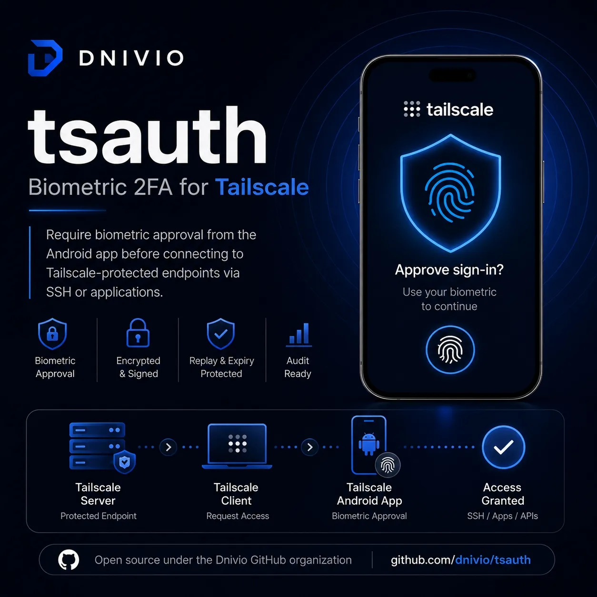

# tsauth — Biometric Access Verification for Tailscale

**⚠️ Active development. Not yet ready for production use.**



tsauth adds biometric step-up verification to [Tailscale](https://tailscale.com/) network access. Before a protected resource can be reached — whether a browser application, native API, database, or SSH server — the user must approve the access attempt using device-native biometrics (fingerprint or facial recognition) on a trusted mobile device.

## How It Works

1. A user or application attempts to reach a protected Tailscale resource.
2. The tsauth enforcement daemon on the destination node evaluates policy and pauses the connection.
3. An approval request is sent to the user's enrolled Android device.
4. The user verifies their identity with fingerprint or face unlock.
5. Upon approval, a short-lived, cryptographically bound Access Grant Token is issued.
6. The daemon validates the grant and releases the traffic.

The approval device never sees the protected content — only the metadata: destination, requesting device, access type, and timestamp.

## Architecture

| Component | Path | Description |
|---|---|---|
| Contracts & Protocols | `contracts/` | Shared types, COSE/CBOR canonicalization, protobuf, OpenAPI |
| Approval Service | `service/` | Central authorization service in Go |
| Enforcement Daemon | `daemon/` | Per-node enforcement hooks for forked `tailscaled` |
| Android Approver | `android/` | Biometric approval application (Kotlin) |
| Go SDK | `sdk/go/` | HTTP client with automatic challenge/response handling |

## Enforcement Modes

- **HTTP_PROXY** — TLS-terminating reverse proxy with browser interstitial
- **OPAQUE_TCP** — Accept-and-hold proxy for native applications, databases, and raw TCP APIs
- **TS_SSH** — Tailscale SSH session gating with account awareness
- **OPENSSH** — Standard OpenSSH via PAM (Linux/macOS) and AuthorizedKeysCommand (Windows)

## Cryptographic Design

- **COSE_Sign1** with **Ed25519** for all signed envelopes (requests, grants, policies, audit checkpoints)
- **Deterministic CBOR** encoding for cross-language canonicalization
- **Four separate signing keys**: `request_sig`, `grant_sig`, `policy_sig`, `audit_checkpoint_sig`
- **Two Android keys**: `device_auth` (background channel, deny) and `approval_auth` (biometric-gated approve)
- **Air-gapped offline root** signs online key sets
- **HashiCorp Vault Transit** for production signing and envelope encryption
- **Multi-tenant** with Row-Level Security and per-tenant audit chains

## Security Properties

- **Default-deny** for protected resources — unknown identity, protocol, or policy state fails closed
- **Grants bound** to tenant, user, initiating node, destination resource, protocol, scope, and policy version
- **Revocation freshness bound** of 10 seconds with active-session termination
- **Externally anchored audit** — per-tenant serialized hash chain with signed checkpoints to immutable storage
- **Fail-closed** design — policy staleness, revocation lag, KMS outage, or database failure denies access
- **No long-lived bypass tokens** — break-glass requires a 2-of-3 FIDO2 quorum, single session, 15-minute cap

## Quick Start

```bash
# Build all modules
go work sync && make build

# Run tests
make test-unit

# Apply database migrations
DATABASE_URL=postgres://localhost:5432/tsauth make db-migrate

# Start the approval service
cd service && go run ./cmd/approval-service/ -config /etc/dnivio/config.json
```

## Documentation

- [`design.md`](./design.md) — Client requirements
- [`ENGINEERING.md`](./ENGINEERING.md) — Normative build specification (v2.1)
- [`ADVERSARIAL_REVIEW.md`](./ADVERSARIAL_REVIEW.md) — External security review (15 Critical, 30 High findings)
- [`ADVERSARIAL_REREVIEW.md`](./ADVERSARIAL_REREVIEW.md) — Re-review confirming all architecture issues resolved
- [`REVIEW_RESPONSE.md`](./REVIEW_RESPONSE.md) — Finding-by-finding resolution map
- [`docs/traceability.csv`](./docs/traceability.csv) — Requirement-to-artifact traceability matrix

## Status

This project is in **active development**. All 15 Critical and 30 High findings from the adversarial review have been resolved in the specification. The Go authorization plane (contracts, service, daemon, SDK) is implemented. Remaining work includes the Android application, full test suite, per-OS enforcement bypass proofs, signed packaging, and independent security review.

## License

Proprietary. All rights reserved.

---

Built to `ENGINEERING.md` v2.1. Developed by [Dnivio](https://github.com/dnivio).
